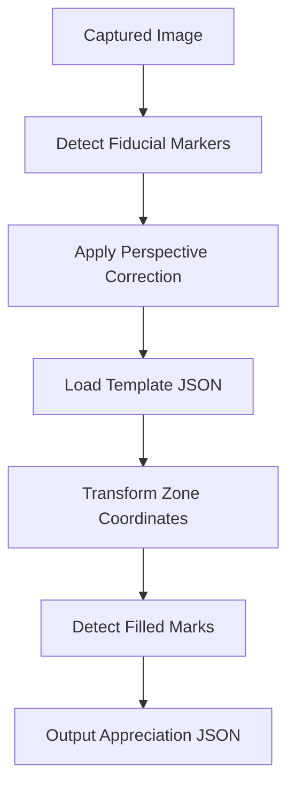

# 🧠 OMR Mark Detection & Appreciation Pipeline Plan

This plan defines the next major step after generating OMR PDFs: to **detect marks on filled documents**, using fiducial alignment, zone mapping, and pixel-based interpretation.

---

## ✅ Input Assumptions

- A **scanned or captured image** of the marked document (JPG, PNG, or webcam snapshot)
- A corresponding **template JSON** file containing:
    - `template_id`
    - `document_id`
    - `fiducials`: x/y positions
    - `zones`: each markable area (e.g., vote or answer option)
- The image contains:
    - 4 printed **black square fiducial markers**
    - Standard **mark zones** (boxes/ovals) with shading or pen marks

---

## 🧱 High-Level Pipeline



---

## 🧪 Detection Logic (OpenCV or OpenCV.js)

### 1. Load & Preprocess Image

```python
img = cv2.imread("scanned.jpg")
gray = cv2.cvtColor(img, cv2.COLOR_BGR2GRAY)
thresh = cv2.threshold(gray, 127, 255, cv2.THRESH_BINARY_INV)[1]
```

### 2. Detect Fiducial Markers (black squares)

- Find contours → filter for square shape (4 points, area > X)
- Sort them into TL, TR, BL, BR based on position
- Extract `(x, y)` of center or bounding box

### 3. Compute Perspective Transform

```python
matrix = cv2.getPerspectiveTransform(src_pts, dst_pts)
warped = cv2.warpPerspective(img, matrix, (template_width, template_height))
```

### 4. Detect Filled Zones

Loop through zone ROIs from template:

```python
for zone in zones:
    x, y, w, h = zone["x"], zone["y"], zone["width"], zone["height"]
    roi = warped[y:y+h, x:x+w]
    roi_gray = cv2.cvtColor(roi, cv2.COLOR_BGR2GRAY)
    roi_bin = cv2.threshold(roi_gray, 127, 255, cv2.THRESH_BINARY_INV)[1]
    
    filled_ratio = cv2.countNonZero(roi_bin) / (w * h)
    if filled_ratio > 0.5:
        zone["filled"] = True
```

---

## ✅ Output

```json
{
  "document_id": "BALLOT-ABC-001-PDF-147",
  "template_id": "ballot-v1",
  "results": [
    { "contest": "PRESIDENT", "code": "CAND001", "filled": true },
    { "contest": "PRESIDENT", "code": "CAND002", "filled": false },
    ...
  ]
}
```

---

## 🧰 Deployment Options

| Approach | Stack | When to Use |
|---------|-------|-------------|
| ✅ **OpenCV.js in Vue/Browser** | Fully offline, airgapped, real-time feedback | Precinct or kiosk |
| ✅ **Python OpenCV** | More robust, faster, easier dev | Back-office scan processing |
| ⬜ Electron App | Bundle Python or OpenCV.js with Laravel UI | Desktop setting |
| ⬜ Mobile app | Native scan & appreciation | If needed in field

---

## 🔐 Security & Verification

- ✅ Match barcode → `document_id` in template
- ✅ Log image hash + appreciation result
- ✅ Store raw + corrected image
- ✅ Support manual override UI for low-confidence marks

---

## 🧠 Future Add-Ons

- 👁️ Confidence threshold & human-in-the-loop UI
- 🧾 Generate audit-ready cast vote records
- 🧪 Test suite with simulated marked forms
- 📸 Webcam snap + appreciation in Vue + canvas overlay
