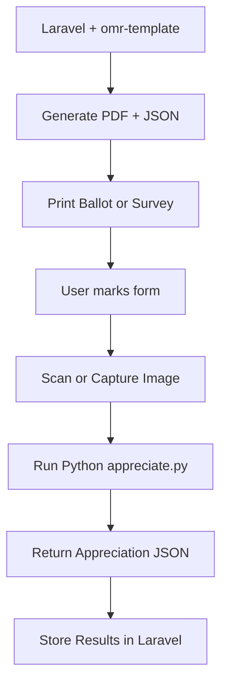

# 🧠 Laravel + Python OpenCV OMR Appreciation Integration Plan
*End-to-End: Calibrate → Generate → Appreciate*

This plan documents the full hybrid pipeline that integrates:

- 🧱 Laravel for **template generation**
- 🖨️ DOMPDF + Handlebars for **print-ready PDFs**
- 🧩 Fiducial markers and barcoded document identifiers
- 📸 Captured or scanned **filled forms**
- 🐍 Python + OpenCV for **image alignment and mark appreciation**

---

## 📚 Pipeline Overview



---

## 🧱 Project Structure

```
omr-appreciation/
├── src/
│   └── Services/
│       └── OMRAppreciator.php      # Laravel → Python wrapper
├── omr-python/
│   ├── appreciate.py               # Main appreciation script
│   ├── image_aligner.py            # Fiducial detection + warp
│   ├── mark_detector.py            # Filled box detector
│   ├── utils.py                    # Shared helpers (load JSON, ROI tools)
│   ├── requirements.txt            # Python deps (OpenCV, numpy)
```

---

## 1️⃣ Calibration + Template Generation (Laravel)

Handled via `lbhurtado/omr-template`:

- Use Handlebars to layout mark zones + fiducials
- Include `document_id` in both:
    - PDF printout (visible + barcode)
    - Output JSON (`template_id`, `zones`, `fiducials`)
- Save output as:
    - `ballot-XYZ-PDF-147.pdf`
    - `ballot-XYZ-PDF-147.json`

**No changes needed here**.

---

## 2️⃣ Capturing Filled Form

Accepted input:
- 📸 Camera snapshot (JPEG, PNG)
- 🖨️ Scanner output
- Image file must match printed scale (preferably 300 DPI)

---

## 3️⃣ Python Script: `appreciate.py`

**Entrypoint** for appreciating a filled OMR form.

### Usage:

```bash
python appreciate.py path/to/image.jpg path/to/template.json
```

### Responsibilities:

- Load image and template
- Detect 4 fiducial markers
- Apply perspective transform
- Loop through each mark zone (ROI)
- Determine fill status
- Output JSON

### Output:

```json
{
  "document_id": "BALLOT-ABC-001-PDF-147",
  "template_id": "ballot-v1",
  "results": [
    { "contest": "PRESIDENT", "code": "CAND001", "filled": true },
    { "contest": "VICE-PRESIDENT", "code": "CAND005", "filled": false }
  ]
}
```

---

## 4️⃣ Python Dependencies

**File:** `requirements.txt`

```txt
opencv-python
numpy
```

**Setup:**

```bash
cd omr-python
python3 -m venv venv
source venv/bin/activate
pip install -r requirements.txt
```

---

## 5️⃣ Laravel Integration: `OMRAppreciator.php`

```php
namespace LBHurtado\OMRAppreciation\Services;

class OMRAppreciator
{
    public function run(string $imagePath, string $templatePath): array
    {
        $python = base_path('omr-appreciation/omr-python/venv/bin/python');
        $script = base_path('omr-appreciation/omr-python/appreciate.py');

        $command = escapeshellcmd("$python $script $imagePath $templatePath");
        $output = shell_exec($command);

        if (! $output) {
            throw new \RuntimeException("No response from OMR Python script.");
        }

        return json_decode($output, true);
    }
}
```

---

## 6️⃣ Appreciation Logic (Python)

Each Python module is reusable:

### `image_aligner.py`
- Detects 4 black squares
- Computes perspective transform
- Returns aligned (deskewed) image

### `mark_detector.py`
- Loops through each ROI from `template['zones']`
- Calculates fill ratio via pixel density
- Marks each zone as `filled: true/false`

### `appreciate.py`
- Orchestrates full pipeline
- Loads template
- Calls alignment and detection
- Dumps result as JSON

---

## 🧪 Laravel Usage Example

```php
$results = (new OMRAppreciator)->run(
    storage_path('omr/filled/ballot-ABC-PDF-147.jpg'),
    storage_path('omr/templates/ballot-ABC-PDF-147.json')
);

// Save, validate, audit, or respond with $results
```

---

## ✅ End-to-End Test Case

1. Generate ballot via `omr-template`
2. Print + mark ballot
3. Scan or photograph
4. Run `php artisan omr:appreciate` or invoke service
5. Inspect resulting JSON

Add to Pest or PHPUnit as automated tests using fixtures.

---

## ✅ Summary

You now have a full pipeline:
- 🎯 **Template** design via Laravel
- 🆔 **Unique IDs** + barcode for pairing
- ⬛ **Fiducial anchors** for deskewing
- 🧠 **Python OMR** script that interprets the image
- 📤 **Laravel bridge** to return structured results

This pipeline is:
- Airgap‑compatible ✅
- Secure + audit‑ready ✅
- Easy to test and extend ✅
- Works with ballots, surveys, exams ✅
