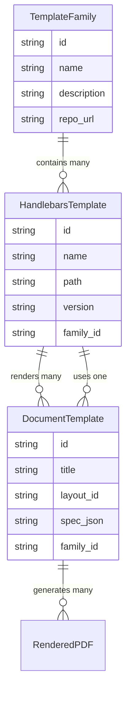

# 🧭 OMR Template Registry & Composition System (OTRCS)

> A registry-driven architecture that connects **Document Templates (JSON)** and **Handlebars Layout Templates (HBS)** through a **Template Family Registry**, enabling one-to-many relationships, version control, and public storage (e.g., GitHub).

---

## 1️⃣ Core Idea

The ecosystem consists of **three core entities**:

| Entity | Purpose | Example |
|---------|----------|---------|
| **Document Template (JSON Spec)** | Describes *what* to render (sections, choices, scales, etc.) | `ballot.json`, `survey.json` |
| **Handlebars Template (HBS Layout)** | Describes *how* to render visually (structure and HTML semantics) | `ballot.hbs`, `survey.hbs` |
| **Template Family (Registry Metadata)** | Groups related templates and defines correspondence rules | `ballot-family.yml` or registry DB record |

This forms a **decoupled schema–layout–renderer triad**.

---

## 2️⃣ Relationships Overview



---

## 3️⃣ Data Model Examples

### Template Family (`template-family.json`)
```json
{
  "id": "ballot-2025",
  "name": "Philippine Election Ballot Family",
  "description": "All ballot layouts for national and local positions.",
  "repo_url": "https://github.com/lbhurtado/omr-template-families/ballot",
  "layouts": [
    {
      "id": "ballot-a4-portrait",
      "path": "templates/ballot/portrait-a4.hbs",
      "version": "1.0.0",
      "default": true
    },
    {
      "id": "ballot-a4-landscape",
      "path": "templates/ballot/landscape-a4.hbs",
      "version": "1.0.0"
    }
  ]
}
```

### Document Template (`document-template.json`)
```json
{
  "document": {
    "title": "Sample Precinct Ballot",
    "unique_id": "BAL-2025-0000123",
    "template_family": "ballot-2025",
    "template_layout": "ballot-a4-portrait",
    "locale": "en-PH"
  },
  "sections": [
    { "type": "multiple_choice", "title": "President", "choices": [ ... ] }
  ]
}
```

---

## 4️⃣ Template Registry Concept

The **Template Registry** may live:

- As a **GitHub repository** (`templates/` folder + `manifest.json`)
- As a **database-backed Laravel model** (synced via API)
- As a **hybrid** (local cache of remote GitHub manifests)

### Example `manifest.json`
```json
{
  "families": [
    {
      "id": "ballot-2025",
      "repo": "https://github.com/lbhurtado/omr-template-families/ballot",
      "layouts": ["ballot-a4-portrait", "ballot-a4-landscape"]
    },
    {
      "id": "survey-2025",
      "repo": "https://github.com/lbhurtado/omr-template-families/survey",
      "layouts": ["survey-basic", "survey-detailed"]
    }
  ]
}
```

### Laravel Integration Example
```php
class SyncTemplateFamiliesFromGitHub extends Command {
    public function handle() {
        $manifest = json_decode(file_get_contents('https://raw.githubusercontent.com/.../manifest.json'), true);
        foreach ($manifest['families'] as $family) {
            TemplateFamily::updateOrCreate(['id' => $family['id']], $family);
        }
    }
}
```

---

## 5️⃣ Rendering Flow

```mermaid
flowchart TD
  A[DocumentTemplate JSON] -->|references| B[TemplateFamily Registry]
  B --> C[Handlebars Template (.hbs)]
  C --> D[SmartLayoutRenderer (TCPDF)]
  D --> E[PDF + Coords JSON]
```

**Step-by-step:**
1. User submits JSON.
2. System reads `template_family` and `template_layout` fields.
3. Template is fetched from Registry (local or remote).
4. Handlebars compiles the layout using JSON data.
5. TCPDF renderer generates final PDF and coordinates.

---

## 6️⃣ Benefits

✅ **Reusability:** Multiple documents can share the same family.  
✅ **Version Control:** Families evolve with semantic versioning.  
✅ **Decentralized Storage:** Templates hosted on GitHub or S3.  
✅ **Extensibility:** Supports multiple renderers (HTML, PDF, SVG).  
✅ **Integrity:** Families can be signed or hashed for verification.

---

## 7️⃣ Suggested Folder Structure

```text
omr-templates/
├─ registry/
│  ├─ manifest.json
│  ├─ families/
│  │  ├─ ballot-2025/
│  │  │  ├─ family.json
│  │  │  └─ templates/
│  │  │     ├─ ballot-a4-portrait.hbs
│  │  │     ├─ ballot-a4-landscape.hbs
│  │  │     └─ README.md
│  │  └─ survey-2025/
│  │     ├─ family.json
│  │     └─ templates/
│  │        └─ survey-basic.hbs
├─ public/
│  └─ sample-documents/
│     └─ document-template.json
```

---

## 8️⃣ UI Integration

In the **Vue 3 interface**, users can:

- Browse public template families (`/api/templates/families`)
- Select layout (portrait, landscape, etc.)
- Paste or upload JSON spec
- Render and preview PDF immediately

---

## 9️⃣ Naming Options

| Option | Description | Tone |
|---------|--------------|------|
| **Template Registry System (TRS)** | General-purpose registry | Neutral |
| **OMR Template Registry (OTR)** | Focused on OMR ecosystem | Descriptive |
| **Template Composition Engine (TCE)** | Highlights JSON ↔ HBS pairing | Architectural |
| **Document Template Graph (DTG)** | Describes relational links | Academic |
| **Template Fabric** | Creative name emphasizing interconnection | Marketing |

✅ **Recommended Name:** **OMR Template Registry (OTR)** — clear, descriptive, compatible with GitHub-hosted registries.

---

## 🔟 Future Enhancements

- Template signing with GPG/SHA256.
- Auto-sync from GitHub using Actions.
- Schema-based validation (JSON Schema).
- Version pinning & rollback support.
- Public REST API for external template consumers.

---

## ✅ Summary

This **Template Registry & Composition System** connects:

- **Document JSONs** → **Handlebars Layouts** → **Rendered Outputs**,  
  with **versioned Template Families** stored in public repositories.

This design turns your OMR ecosystem into a **distributed, collaborative, and verifiable document generation network**, ready for open-source and institutional collaboration.

---
