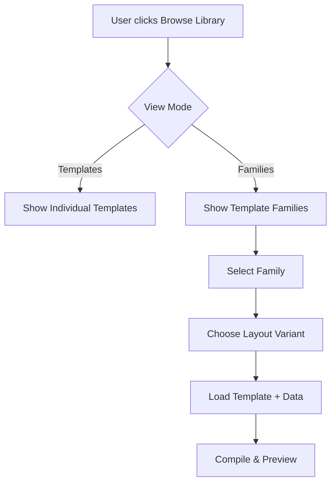

# 🚀 OMR Template Registry & Composition System - Truth Integration Roadmap

> Roadmap for integrating the **OMR Template Registry & Composition System (OTRCS)** with the Truth app's existing template library system.

---

## Current State Analysis

### ✅ What We Have

| Component | Status | Location |
|-----------|--------|----------|
| **Template Library UI** | ✅ Implemented | `resources/js/pages/Templates/Components/TemplateLibrary.vue` |
| **Template Storage** | ✅ Working | `Template` model, `templates` table |
| **Template Instances** | ✅ Working | `TemplateInstance` model tracks rendered documents |
| **Handlebars Compilation** | ✅ Working | Advanced Editor with data separation |
| **Sample Templates** | ✅ Working | Philippine Elections, Barangay Elections |

### ❌ What's Missing (from OTRCS)

| Component | Priority | Description |
|-----------|----------|-------------|
| **Template Families** | 🔴 High | Group related templates (e.g., "Ballot Family 2026") |
| **Version Control** | 🔴 High | Semantic versioning for templates |
| **Layout Variants** | 🟡 Medium | Multiple layouts per family (portrait/landscape) |
| **GitHub Sync** | 🟡 Medium | Pull templates from public repos |
| **Template Signing** | 🟢 Low | Verify template integrity with GPG/SHA256 |
| **Public Registry** | 🟢 Low | Browse templates from community repos |

---

## Phase 1: Template Families Foundation 🎯

### 1.1 Database Schema

**New Migration**: `create_template_families_table.php`

```php
Schema::create('template_families', function (Blueprint $table) {
    $table->id();
    $table->string('slug')->unique(); // e.g., 'ballot-2026'
    $table->string('name'); // e.g., 'Philippine Election Ballot 2026'
    $table->text('description')->nullable();
    $table->string('category'); // ballot, survey, test
    $table->string('repo_url')->nullable(); // GitHub URL
    $table->string('version')->default('1.0.0'); // Semantic version
    $table->boolean('is_public')->default(true);
    $table->foreignId('user_id')->nullable()->constrained();
    $table->timestamps();
    
    $table->index(['category', 'is_public']);
});
```

**Update Migration**: Add to `templates` table

```php
$table->foreignId('family_id')->nullable()->constrained('template_families');
$table->string('layout_variant')->default('default'); // portrait, landscape, etc.
$table->string('version')->default('1.0.0');
```

### 1.2 Models

**New Model**: `app/Models/TemplateFamily.php`

```php
class TemplateFamily extends Model
{
    protected $fillable = [
        'slug', 'name', 'description', 'category',
        'repo_url', 'version', 'is_public', 'user_id'
    ];
    
    public function templates()
    {
        return $this->hasMany(Template::class, 'family_id');
    }
    
    public function defaultTemplate()
    {
        return $this->hasOne(Template::class, 'family_id')
            ->where('layout_variant', 'default');
    }
    
    public function layoutVariants()
    {
        return $this->templates()
            ->select('layout_variant')
            ->distinct()
            ->pluck('layout_variant');
    }
}
```

**Update Model**: `app/Models/Template.php`

```php
public function family()
{
    return $this->belongsTo(TemplateFamily::class);
}

public function isDefaultLayout(): bool
{
    return $this->layout_variant === 'default';
}
```

---

## Phase 2: UI Integration 🎨

### 2.1 Family Browser Component

**New Component**: `resources/js/pages/Templates/Components/FamilyBrowser.vue`

**Features**:
- Grid view of template families
- Category filter (ballot, survey, test)
- Search by family name
- Click to see layout variants
- Version display
- GitHub repo link (if available)

### 2.2 Layout Variant Selector

**Integration**: `AdvancedEditor.vue`

**Features**:
- Dropdown to select family first
- Then select layout variant (portrait, landscape, etc.)
- Show version info
- Preview layout differences

### 2.3 Updated Library Flow



---

## Phase 3: Version Control 📦

### 3.1 Semantic Versioning

**Implementation**:
- Store version as `major.minor.patch` (e.g., `1.2.3`)
- Auto-increment patch on save (optional)
- Allow manual version bumps
- Track version history in separate table

**New Table**: `template_versions`

```php
Schema::create('template_versions', function (Blueprint $table) {
    $table->id();
    $table->foreignId('template_id')->constrained('templates');
    $table->string('version'); // 1.0.0, 1.0.1, etc.
    $table->longText('handlebars_template');
    $table->json('sample_data')->nullable();
    $table->text('changelog')->nullable();
    $table->foreignId('created_by')->constrained('users');
    $table->timestamps();
    
    $table->unique(['template_id', 'version']);
});
```

### 3.2 Rollback Support

**Features**:
- View version history
- Compare versions (diff view)
- Restore previous version
- Tag versions (e.g., "stable", "beta")

---

## Phase 4: GitHub Integration 🔗

### 4.1 GitHub Sync Command

**New Command**: `app/Console/Commands/SyncTemplateFamilies.php`

```php
php artisan templates:sync-github [repo-url]
```

**Features**:
- Fetch `manifest.json` from GitHub repo
- Pull `.hbs` template files
- Update/create template families
- Verify checksums
- Handle version conflicts

### 4.2 Manifest Format

**Example**: `manifest.json` in GitHub repo

```json
{
  "family": {
    "slug": "ballot-2026-ph",
    "name": "Philippine Election Ballots 2026",
    "version": "1.0.0",
    "category": "ballot"
  },
  "layouts": [
    {
      "variant": "portrait-a4",
      "file": "templates/ballot-portrait.hbs",
      "default": true,
      "version": "1.0.0",
      "checksum": "sha256:abc123..."
    },
    {
      "variant": "landscape-a4",
      "file": "templates/ballot-landscape.hbs",
      "version": "1.0.0",
      "checksum": "sha256:def456..."
    }
  ],
  "sample_data": "samples/sample-ballot.json"
}
```

### 4.3 Public Registry

**Concept**: Central registry of community templates

```
https://github.com/lbhurtado/omr-template-registry
├── manifest.json (list of all families)
├── families/
│   ├── ballot-2026-ph/
│   │   ├── family.json
│   │   └── templates/
│   │       ├── ballot-portrait.hbs
│   │       └── ballot-landscape.hbs
│   └── survey-satisfaction/
│       ├── family.json
│       └── templates/
│           └── survey-basic.hbs
```

---

## Phase 5: Advanced Features 🎁

### 5.1 Template Validation

**JSON Schema Support**:
- Store schema in `templates.schema`
- Validate data before rendering
- Show validation errors in UI
- Auto-generate sample data from schema

### 5.2 Template Signing

**GPG/SHA256 Verification**:
- Sign templates with GPG key
- Store signature in database
- Verify on load
- Show trust indicator in UI

### 5.3 Dependency Management

**Template Dependencies**:
- Templates can reference partials
- Shared components (e.g., header, footer)
- Automatic dependency resolution
- Bundle templates with dependencies

---

## Implementation Priority

### Sprint 1 (Foundation) - 2 weeks
- ✅ Create `template_families` table
- ✅ Add `family_id` to `templates`
- ✅ Create `TemplateFamily` model
- ✅ Seed existing templates into families
- ✅ Basic family CRUD API

### Sprint 2 (UI) - 2 weeks
- ✅ Family browser component
- ✅ Layout variant selector
- ✅ Update AdvancedEditor integration
- ✅ Family management UI

### Sprint 3 (Versioning) - 1 week
- ✅ Add version fields
- ✅ Create `template_versions` table
- ✅ Version history UI
- ✅ Rollback functionality

### Sprint 4 (GitHub Sync) - 2 weeks
- ✅ Sync command
- ✅ Manifest parser
- ✅ Checksum verification
- ✅ Public registry integration

### Sprint 5 (Polish) - 1 week
- ✅ Validation
- ✅ Documentation
- ✅ Testing
- ✅ Performance optimization

---

## Migration Strategy

### Existing Templates → Families

**Seeder**: `database/seeders/ConvertTemplatesToFamiliesSeeder.php`

```php
public function run()
{
    // Group existing templates by category and name similarity
    $templates = Template::all();
    
    foreach ($templates as $template) {
        // Create family for each unique template
        $family = TemplateFamily::create([
            'slug' => Str::slug($template->name),
            'name' => $template->name,
            'category' => $template->category,
            'version' => '1.0.0',
            'is_public' => $template->is_public,
            'user_id' => $template->user_id,
        ]);
        
        // Link template to family
        $template->update([
            'family_id' => $family->id,
            'layout_variant' => 'default',
            'version' => '1.0.0',
        ]);
    }
}
```

---

## API Endpoints

```php
// Families
GET    /api/template-families          // List all families
GET    /api/template-families/{id}      // Get family details
POST   /api/template-families           // Create family
PUT    /api/template-families/{id}      // Update family
DELETE /api/template-families/{id}      // Delete family

// Variants
GET    /api/template-families/{id}/layouts   // Get layout variants
POST   /api/template-families/{id}/layouts   // Add layout variant

// Sync
POST   /api/template-families/sync-github    // Sync from GitHub
GET    /api/template-families/registry       // Browse public registry

// Versions
GET    /api/templates/{id}/versions          // Version history
POST   /api/templates/{id}/versions          // Create new version
POST   /api/templates/{id}/rollback/{version} // Rollback
```

---

## Benefits for Truth App

1. **Organization**: Group related templates (National Elections, Barangay Elections, etc.)
2. **Flexibility**: Multiple layouts per family (portrait, landscape, different paper sizes)
3. **Collaboration**: Share template families via GitHub
4. **Versioning**: Track changes, rollback if needed
5. **Trust**: Verify templates with checksums/signatures
6. **Scalability**: Public registry for community-contributed templates

---

## Next Steps

1. **Review & Approve** this roadmap
2. **Create migration files** for Phase 1
3. **Implement TemplateFamily model**
4. **Migrate existing templates** into families
5. **Build Family Browser UI**
6. **Test with Barangay Elections family** (already has ballot + mapping variants!)

---

## Example: Barangay Elections as a Family

**Perfect Use Case**: We already have:
- `barangay-election-template.hbs` (ballot with numbered bubbles)
- `barangay-election-mapping-template.hbs` (candidate reference)

**Convert to Family**:
```json
{
  "slug": "barangay-2026",
  "name": "2026 Barangay Elections",
  "category": "ballot",
  "layouts": [
    {
      "variant": "ballot-numbered",
      "file": "barangay-election-template.hbs",
      "description": "Ballot with numbered bubbles only"
    },
    {
      "variant": "candidate-mapping",
      "file": "barangay-election-mapping-template.hbs",
      "description": "Reference document showing candidate names"
    }
  ]
}
```

This demonstrates the power of template families immediately! 🎉
