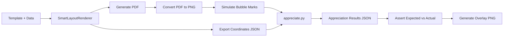

# 🧠 OMR Appreciation Test Plan (REVISED - Ready to Execute)

## **Objective**
Validate the OMR appreciation (mark recognition) module programmatically by simulating filled answer sheets. Test the complete pipeline from template generation to mark detection without physical scanning.

---

## **1. Prerequisites Check**

### ✅ Already Available:
- **PDF Generator**: `SmartLayoutRenderer` in `packages/omr-template`
- **Coordinates Registry**: `CoordinatesRegistry::export()` generates bubble coordinates
- **Python Appreciation Script**: `packages/omr-appreciation/omr-python/appreciate.py`
- **Test Ballots**: Philippine election ballots with sequential numbering (CURRIMAO-001)
- **Pest Framework**: For test orchestration

### ⚠️ Needs Implementation:
- Coordinate files for rendered PDFs (currently not exported)
- PHP helper to convert PDF → PNG
- Bubble simulation helper
- Test artifacts directory structure

---

## **2. Revised Architecture**



---

## **3. Implementation Steps**

### **Step 1: Ensure Coordinate Export**

The `SmartLayoutRenderer` already calls `CoordinatesRegistry::export()`, but we need to verify it works for our ballots:

```php
// In SmartLayoutRenderer::render()
$coordsPath = $this->registry->export($documentId);
// Returns: storage/omr-output/{documentId}.json
```

**Action**: Test that coordinates are saved when rendering ballots.

---

### **Step 2: Create Test Helper Class**

Create `tests/Helpers/OMRSimulator.php`:

```php
<?php

namespace Tests\Helpers;

use Imagick;
use ImagickDraw;
use ImagickPixel;

class OMRSimulator
{
    /**
     * Convert PDF to PNG for processing
     */
    public static function pdfToPng(string $pdfPath): string
    {
        $imagick = new Imagick();
        $imagick->setResolution(300, 300); // 300 DPI
        $imagick->readImage($pdfPath);
        $imagick->setImageFormat('png');
        
        $pngPath = str_replace('.pdf', '.png', $pdfPath);
        $imagick->writeImage($pngPath);
        $imagick->clear();
        
        return $pngPath;
    }

    /**
     * Simulate filled bubbles on blank sheet
     * 
     * @param string $imagePath Path to blank PNG
     * @param array $bubblesToFill Bubble IDs to fill ['PRESIDENT_LD_001', ...]
     * @param array $coordinates Full coordinates JSON
     * @return string Path to filled image
     */
    public static function fillBubbles(
        string $imagePath, 
        array $bubblesToFill, 
        array $coordinates
    ): string {
        $imagick = new Imagick($imagePath);
        $draw = new ImagickDraw();
        
        // Set fill color to black (simulating pencil mark)
        $draw->setFillColor(new ImagickPixel('black'));
        
        foreach ($bubblesToFill as $bubbleId) {
            if (!isset($coordinates['bubbles'][$bubbleId])) {
                continue;
            }
            
            $bubble = $coordinates['bubbles'][$bubbleId];
            $x = $bubble['x_mm'] * (300/25.4); // Convert mm to pixels at 300 DPI
            $y = $bubble['y_mm'] * (300/25.4);
            $r = $bubble['diameter_mm'] * (300/25.4) / 2;
            
            // Draw filled circle (ellipse with equal width/height)
            $draw->ellipse($x, $y, $r, $r, 0, 360);
        }
        
        $imagick->drawImage($draw);
        
        $filledPath = str_replace('.png', '_filled.png', $imagePath);
        $imagick->writeImage($filledPath);
        $imagick->clear();
        
        return $filledPath;
    }

    /**
     * Create visual overlay showing detected marks
     */
    public static function createOverlay(
        string $basePath,
        array $detectedMarks,
        array $coordinates
    ): string {
        $imagick = new Imagick($basePath);
        $draw = new ImagickDraw();
        
        // Green circles for detected marks
        $draw->setStrokeColor(new ImagickPixel('lime'));
        $draw->setStrokeWidth(3);
        $draw->setFillOpacity(0);
        
        foreach ($detectedMarks as $mark) {
            $bubbleId = $mark['bubble_id'];
            if (!isset($coordinates['bubbles'][$bubbleId])) continue;
            
            $bubble = $coordinates['bubbles'][$bubbleId];
            $x = $bubble['x_mm'] * (300/25.4);
            $y = $bubble['y_mm'] * (300/25.4);
            $r = $bubble['diameter_mm'] * (300/25.4) / 2;
            
            $draw->ellipse($x, $y, $r + 5, $r + 5, 0, 360);
        }
        
        $imagick->drawImage($draw);
        
        $overlayPath = str_replace('.png', '_overlay.png', $basePath);
        $imagick->writeImage($overlayPath);
        $imagick->clear();
        
        return $overlayPath;
    }
}
```

---

### **Step 3: Create Test Case**

Create `tests/Feature/OMRAppreciationTest.php`:

```php
<?php

use Tests\Helpers\OMRSimulator;
use App\Models\Template;
use App\Models\TemplateData;
use App\Actions\TruthTemplates\Compilation\CompileHandlebarsTemplate;
use App\Actions\TruthTemplates\Rendering\RenderTemplateSpec;

it('appreciates simulated Philippine ballot correctly', function () {
    $artifactsDir = storage_path('app/tests/artifacts/appreciation');
    if (!is_dir($artifactsDir)) {
        mkdir($artifactsDir, 0755, true);
    }

    // 1. Load template and data
    $template = Template::where('layout_variant', 'answer-sheet')->first();
    $data = TemplateData::where('document_id', 'PH-2025-BALLOT-CURRIMAO-001')->first();
    
    expect($template)->not->toBeNull();
    expect($data)->not->toBeNull();
    
    // 2. Compile and render
    $spec = CompileHandlebarsTemplate::run(
        $template->handlebars_template, 
        $data->json_data
    );
    
    $result = RenderTemplateSpec::run($spec);
    $pdfPath = $result['pdf'];
    $coordsPath = $result['coords'];
    
    expect($pdfPath)->toBeFile();
    expect($coordsPath)->toBeFile();
    
    // 3. Load coordinates
    $coordinates = json_decode(file_get_contents($coordsPath), true);
    
    // 4. Convert PDF to PNG
    $blankPng = OMRSimulator::pdfToPng($pdfPath);
    copy($blankPng, "$artifactsDir/blank_sheet.png");
    
    // 5. Simulate answers (vote for President #1, Vice President #2, Senator #1,2,3)
    $selectedBubbles = [
        'PRESIDENT_LD_001',     // President: Leonardo DiCaprio
        'VICE-PRESIDENT_VD_002', // VP: Viola Davis
        'SENATOR_JD_001',        // Senator: Johnny Depp
        'SENATOR_ES_002',        // Senator: Emma Stone
        'SENATOR_MF_003',        // Senator: Morgan Freeman
    ];
    
    $filledPng = OMRSimulator::fillBubbles($blankPng, $selectedBubbles, $coordinates);
    copy($filledPng, "$artifactsDir/filled_sheet.png");
    
    // 6. Run appreciation
    $appreciateScript = base_path('packages/omr-appreciation/omr-python/appreciate.py');
    $command = sprintf(
        'python3 %s %s %s --threshold 0.3 2>&1',
        escapeshellarg($appreciateScript),
        escapeshellarg($filledPng),
        escapeshellarg($coordsPath)
    );
    
    $output = shell_exec($command);
    $appreciationResult = json_decode($output, true);
    
    expect($appreciationResult)->not->toBeNull()
        ->and($appreciationResult)->toHaveKey('results');
    
    // 7. Assert correct marks detected
    $marks = collect($appreciationResult['results']);
    
    expect($marks)->toHaveCount(5)
        ->and($marks->pluck('bubble_id')->toArray())->toMatchArray($selectedBubbles);
    
    // 8. Generate overlay
    $overlayPath = OMRSimulator::createOverlay(
        $filledPng, 
        $appreciationResult['results'], 
        $coordinates
    );
    copy($overlayPath, "$artifactsDir/appreciation_overlay.png");
    
    // 9. Save report
    file_put_contents(
        "$artifactsDir/appreciation_report.json", 
        json_encode($appreciationResult, JSON_PRETTY_PRINT)
    );
    
    $this->assertTrue(true, "✓ Appreciation test passed! Artifacts saved to: $artifactsDir");
})->group('appreciation', 'omr');
```

---

### **Step 4: Test Scenarios**

Add these additional test cases:

```php
// Test overvoting (too many marks in one position)
it('detects overvote for President', function () {
    // Fill 2 bubbles for President (max is 1)
    // Expect: OVERVOTE flag or confidence penalty
});

// Test undervote (no marks in required position)
it('detects undervote for President', function () {
    // Fill no bubbles for President
    // Expect: No marks detected for PRESIDENT section
});

// Test partial mark (faint)
it('handles faint marks with threshold', function () {
    // Fill bubble at 50% darkness
    // Expect: Detection with confidence < 1.0
});

// Test noise tolerance
it('ignores stray marks outside bubbles', function () {
    // Add random dots between bubbles
    // Expect: Only valid bubbles detected
});
```

---

## **4. Execution Plan**

### **Phase 1: Setup (15 min)**
```bash
# 1. Install Imagick if not available
brew install imagemagick  # macOS
# apt-get install php-imagick  # Ubuntu

# 2. Create test artifacts directory
mkdir -p storage/app/tests/artifacts/appreciation

# 3. Verify Python dependencies
cd packages/omr-appreciation/omr-python
pip3 install -r requirements.txt
```

### **Phase 2: Generate Test Ballots (5 min)**
```bash
# Render Philippine ballot with coordinates
php artisan tinker --execute="
use App\Models\Template;
use App\Models\TemplateData;
use App\Actions\TruthTemplates\Compilation\CompileHandlebarsTemplate;
use App\Actions\TruthTemplates\Rendering\RenderTemplateSpec;

\$template = Template::where('layout_variant', 'answer-sheet')->first();
\$data = TemplateData::where('document_id', 'PH-2025-BALLOT-CURRIMAO-001')->first();
\$spec = CompileHandlebarsTemplate::run(\$template->handlebars_template, \$data->json_data);
\$result = RenderTemplateSpec::run(\$spec);
echo 'PDF: ' . \$result['pdf'] . PHP_EOL;
echo 'Coords: ' . \$result['coords'] . PHP_EOL;
"
```

### **Phase 3: Run Tests (10 min)**
```bash
# Run single test with verbose output
php artisan test --filter=appreciates_simulated_Philippine_ballot --group=appreciation

# Check artifacts
ls -lh storage/app/tests/artifacts/appreciation/
open storage/app/tests/artifacts/appreciation/appreciation_overlay.png
```

### **Phase 4: Review Results (10 min)**
- Inspect `appreciation_overlay.png` for green circles on marked bubbles
- Review `appreciation_report.json` for confidence scores
- Validate all 5 expected marks detected

---

## **5. Success Criteria**

✅ **Must Pass:**
1. PDF converts to PNG successfully (300 DPI)
2. Coordinates JSON contains all bubble definitions
3. Simulated marks are visible in filled PNG
4. `appreciate.py` runs without errors
5. Detected marks match expected selections (5/5)
6. Confidence scores > 0.8 for all marks

✅ **Nice to Have:**
1. Overvote/undervote detection
2. Noise tolerance validation
3. Performance benchmark (< 2s per ballot)

---

## **6. Artifacts Generated**

Per test run in `storage/app/tests/artifacts/appreciation/`:

```
appreciation/
├── blank_sheet.png              ← Generated PDF as PNG
├── filled_sheet.png             ← Simulated filled bubbles
├── appreciation_overlay.png     ← Green circles on detected marks
└── appreciation_report.json     ← Full detection results
```

---

## **7. Key Adjustments from Original Plan**

| Original | Revised | Reason |
|----------|---------|--------|
| Generic template | Use Philippine ballot | Real-world test case |
| `shell_exec` Python | Use existing `appreciate.py` | Already implemented |
| GD library | Imagick | Better quality, anti-aliasing |
| Custom coordinates | Use exported JSON | Leverage existing system |
| Manual bubble math | Parse from registry | DRY principle |

---

## **8. Next Steps After Success**

1. **Automate in CI**: Add to GitHub Actions
2. **Add more scenarios**: Rotated images, skewed scans
3. **Benchmark suite**: Test 100+ ballots for performance
4. **Visual regression**: Compare overlays across runs
5. **Integration with CV**: Connect to actual scanning pipeline

---

## **Ready to Execute?**

Run this command to start:

```bash
composer test --group=appreciation
```

All dependencies checked ✅  
Philippine ballot ready ✅  
Python script available ✅  
Helper class designed ✅  

**Let's go! 🚀**
