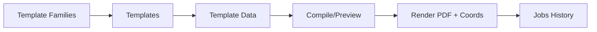
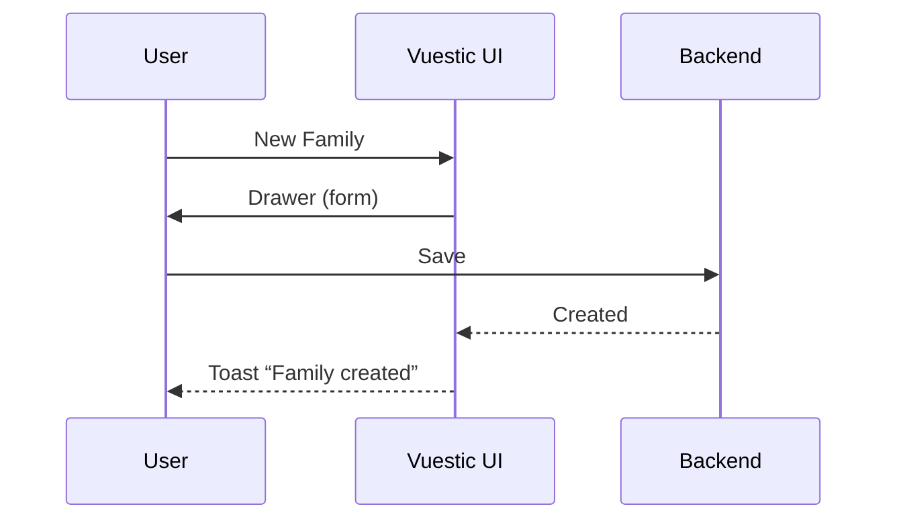
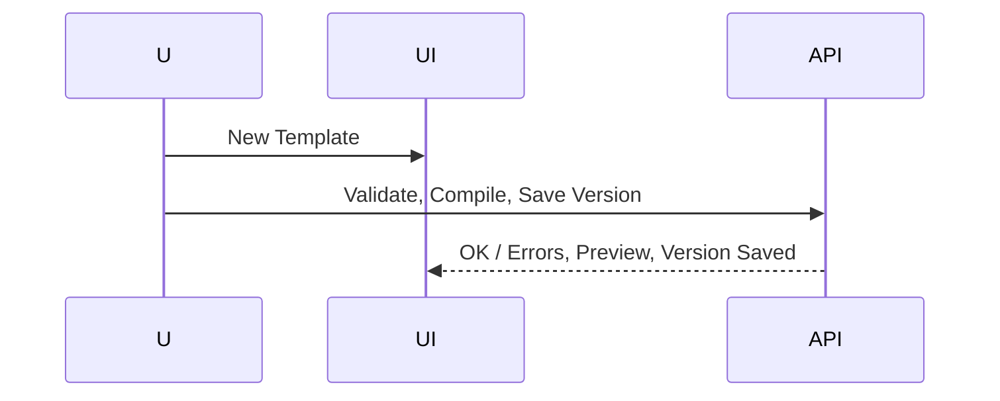
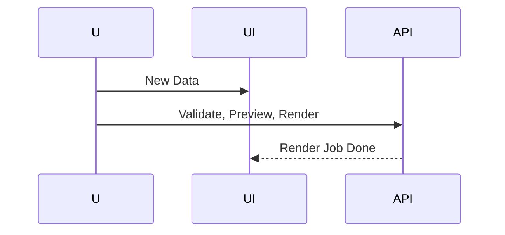

# Vuestic Admin UI/UX Plan — Document Processing (Templates & Data)

## 0) Goals & Design Principles
- **Single mental model**: "Family → Templates → Data → Output".
- **Split-pane creation**: Edit (left) + Live Preview (right).
- **Progressive disclosure**: Start simple; reveal advanced controls as needed.
- **Fast feedback**: Validate + compile in <1s roundtrip where possible; show inline errors.
- **Non-destructive**: Versioned saves, draft autosave, undo, and diff views.
- **Accessibility**: Keyboard-first, high contrast, WCAG AA.
- **Dark mode native**: Vuestic supports this; treat it as first-class.

## 1) Information Architecture (IA)

### Primary navigation (Vuestic sidebar)
- **Dashboard**
- **Template Families**
- **Templates**
- **Template Data**
- **Rendering Jobs**
- **Assets**
- **Settings**

### Secondary navigation (contextual tabs per area)
- Overview | List | Create | Import/Export | Activity | Settings



## 2) Roles & Permissions
- **Admin**: All.
- **Editor**: CRUD, render, import/export.
- **Viewer**: Read-only.
- **Operator**: Render only.

## 3) Key Screens & Layout Patterns

### Dashboard
- KPI cards, recent activity, quick actions.

### Template Families
- List, Create/Edit drawer, Family detail (Tabs: Templates, Variants, Activity, Settings).

### Templates
- List: name, family, variant, tags, version, status.
- Create/Edit: **split editor view** with Handlebars, Schema, Sample Data, Metadata, and Preview tabs.

### Template Data
- List, Create/Edit page with Form/JSON/Preview tabs.
- Preview compiles with `template_ref`.

### Rendering Jobs
- List + Detail view (status, logs, outputs).

### Assets
- Library view; drag-drop upload.

### Settings
- Users & Roles, API keys, Theme, Editor preferences.

## 4) User Flows

### Create Family


### Create Template


### Create Data


## 5) Vuestic Components
- `VaDataTable`, `VaForm`, `VaInput`, `VaTabs`, `VaSplitter`, `VaDrawer`, `VaToast`, `VaModal`, `VaFileUpload`.
- Integrate **Monaco Editor** for code and JSON editing.

## 6) Pinia Stores
- `useFamiliesStore()`, `useTemplatesStore()`, `useDataFilesStore()`, `useJobsStore()`, `useAssetsStore()`.
- Optimistic updates, background polling for renders.

## 7) Routing
- `/`, `/families`, `/templates`, `/data`, `/jobs`, `/assets`, `/settings`.
- Keep-alive editors to preserve unsaved state.

## 8) Validation & Error UX
Inline markers, error tab, retry toasts.

## 9) Versioning
Version timeline, diff view, restore confirmation.

## 10) Theming
Vuestic theme config with Tailwind-like tokens, dark mode, Material icons.

## 11) Performance
Autosave drafts, debounced compile, lazy-load heavy editors.

## 12) Accessibility
Keyboard shortcuts (`Ctrl+S`, `Ctrl+Enter`, `Ctrl+.`), ARIA live toasts.

## 13) Installation Steps

```bash
npm i vuestic-ui @vuestic/ag-grid-theme monaco-editor @monaco-editor/loader pinia vue-router
```

### main.ts
```ts
import { createApp } from 'vue'
import { createPinia } from 'pinia'
import { VuesticPlugin, createVuestic } from 'vuestic-ui'
import App from './App.vue'
import router from './router'

createApp(App)
  .use(createPinia())
  .use(router)
  .use(VuesticPlugin)
  .use(createVuestic({}))
  .mount('#app')
```

## 14) Starter Vue Project Skeleton

### Directory Structure
```
src/
  components/
    editors/
      CodeEditor.vue
      JsonEditor.vue
    preview/
      PreviewPane.vue
  layouts/
    AdminLayout.vue
  pages/
    Dashboard.vue
    Families/
      Index.vue
      Show.vue
    Templates/
      Index.vue
      Edit.vue
    Data/
      Index.vue
      Edit.vue
    Jobs/
      Index.vue
      Show.vue
    Assets/Index.vue
    Settings/Index.vue
  stores/
    families.ts
    templates.ts
    data.ts
    jobs.ts
    assets.ts
  router/index.ts
```

### Example `router/index.ts`
```ts
import { createRouter, createWebHistory } from 'vue-router'
import Dashboard from '../pages/Dashboard.vue'

export default createRouter({
  history: createWebHistory(),
  routes: [
    { path: '/', component: Dashboard },
    { path: '/families', component: () => import('../pages/Families/Index.vue') },
    { path: '/templates', component: () => import('../pages/Templates/Index.vue') },
    { path: '/data', component: () => import('../pages/Data/Index.vue') },
    { path: '/jobs', component: () => import('../pages/Jobs/Index.vue') },
    { path: '/assets', component: () => import('../pages/Assets/Index.vue') },
    { path: '/settings', component: () => import('../pages/Settings/Index.vue') }
  ]
})
```

### Example `stores/families.ts`
```ts
import { defineStore } from 'pinia'

export const useFamiliesStore = defineStore('families', {
  state: () => ({ list: [], loading: false }),
  actions: {
    async fetchFamilies() {
      this.loading = true
      const res = await fetch('/api/families')
      this.list = await res.json()
      this.loading = false
    }
  }
})
```

### Example `components/editors/CodeEditor.vue`
```vue
<template>
  <div ref="container" class="h-full w-full"></div>
</template>
<script setup>
import { onMounted, ref } from 'vue'
import * as monaco from 'monaco-editor'

const props = defineProps({ modelValue: String, language: String })
const emit = defineEmits(['update:modelValue'])
const container = ref()

onMounted(() => {
  const editor = monaco.editor.create(container.value, {
    value: props.modelValue,
    language: props.language || 'handlebars',
    theme: 'vs-dark'
  })
  editor.onDidChangeModelContent(() => {
    emit('update:modelValue', editor.getValue())
  })
})
</script>
```

### Example `layouts/AdminLayout.vue`
```vue
<template>
  <VaLayout>
    <VaSidebar :items="menuItems" />
    <router-view />
  </VaLayout>
</template>
<script setup>
const menuItems = [
  { label: 'Dashboard', to: '/' },
  { label: 'Families', to: '/families' },
  { label: 'Templates', to: '/templates' },
  { label: 'Data', to: '/data' },
  { label: 'Jobs', to: '/jobs' },
  { label: 'Assets', to: '/assets' },
  { label: 'Settings', to: '/settings' }
]
</script>
```

---

### Figma Checklist
- Light/Dark variants of all main screens.
- Empty states + loading skeletons.
- Diff/compare modal.
- Inline help tooltips.

### Deliverables
- Figma file
- Component spec doc
- API contract doc
- Acceptance checklist
- Usability test script

---

### Risks & Mitigation
- Heavy templates → async compile workers.
- Schema drift → migration assistant.
- Accidental overwrite → versioning enforced.
- Learning curve → inline guides.
